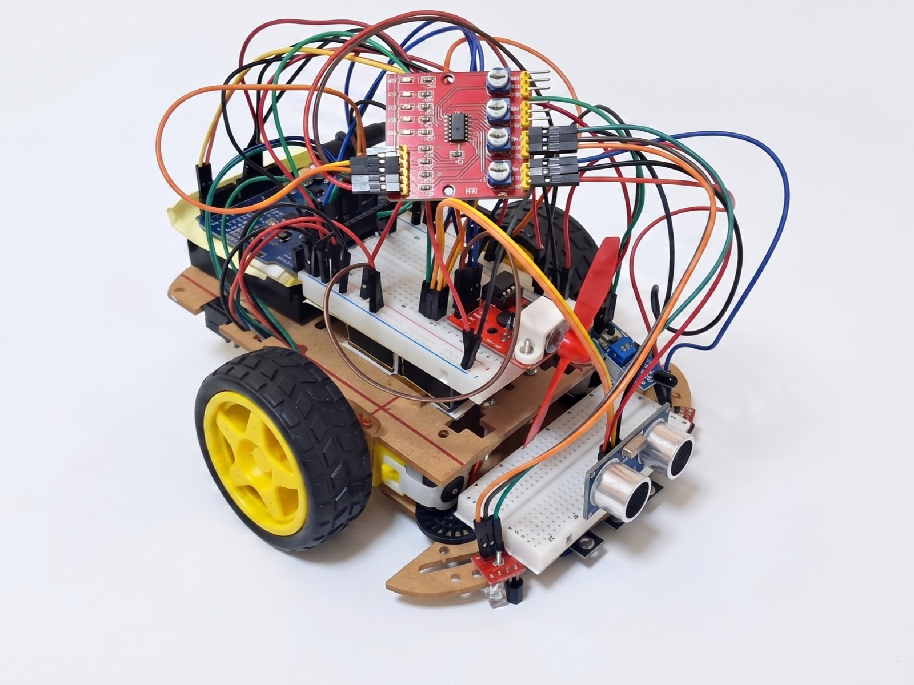
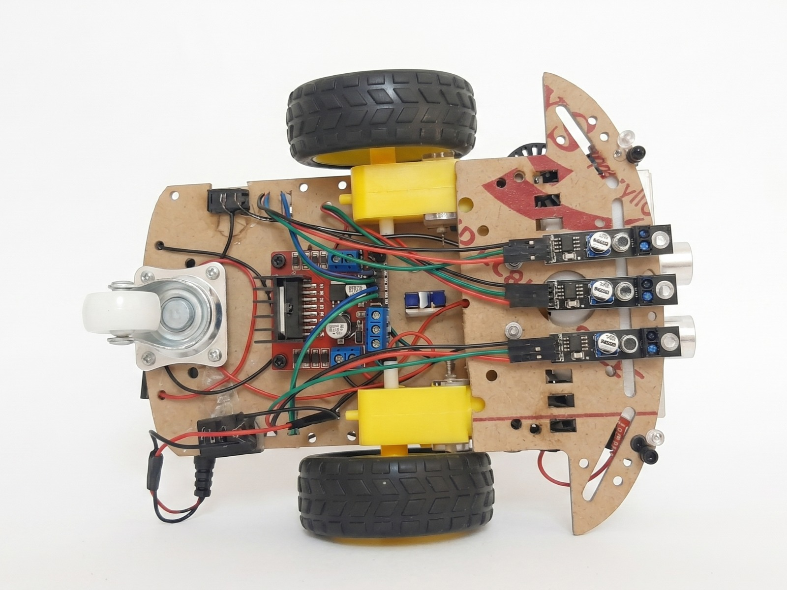
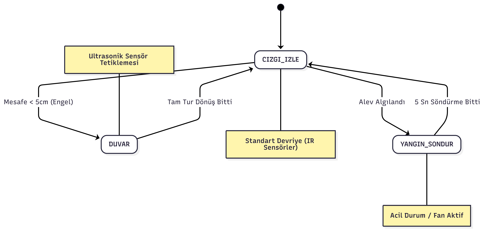
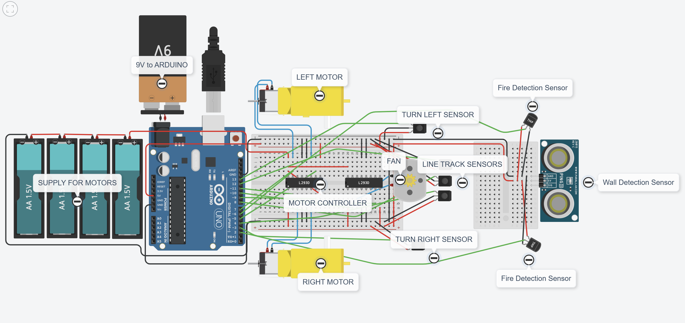
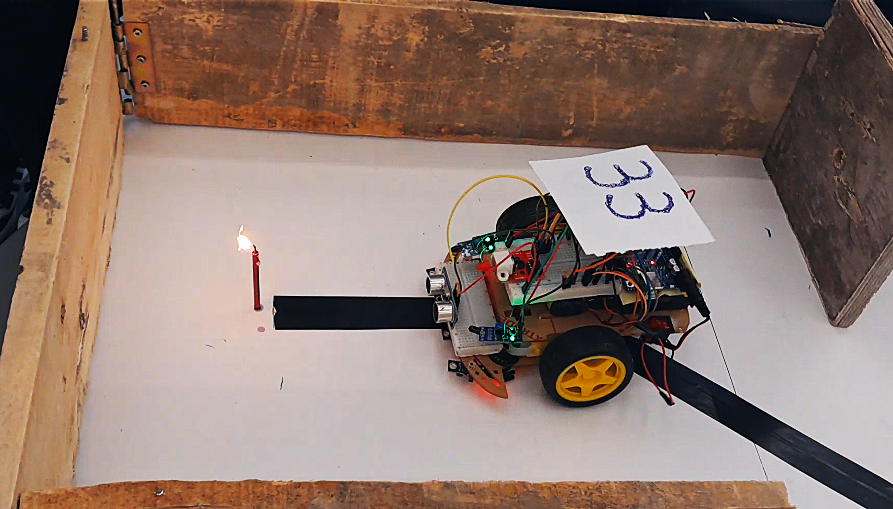

# 🔥 Otonom Yangın Tespit ve Söndürme Robotu

Bu proje, Arduino platformu üzerinde C++ ile geliştirilmiş, nesne yönelimli (OOP) prensipleri temel alan bir otonom robotik sistemdir. Sistem; çizgi izleme, ultrasonik engellerden kaçınma ve alev sensörleri aracılığıyla yangın tespit edip anında müdahale etme süreçlerini etkin bir şekilde yönetmeyi hedeflemektedir.

---
## 🛠 Kullanılan Teknolojiler

- **C++**
- **Arduino UNO (Mikrodenetleyici)**
- **Finite State Machine (Sonlu Durum Makinesi)**
- **CLion & PlatformIO / Arduino IDE**

---
## 🧩 Özellikler

### 📍 Çizgi İzleme (CIZGI_IZLE)
- Merkezdeki 3'lü IR sensör ile hassas rota takibi yapabilir.
- Dış kısımdaki 2 sensör ile kavşakları ve 90 derecelik keskin dönüşleri algılayıp otonom karar verebilir.
- Hız kademeleriyle (Düşük, Orta, Yüksek) toleranslı ve dengeli ilerleyiş sağlar.

### 🛑 Engel Algılama (DUVAR)
- Ultrasonik sensörler ile önüne çıkan engelleri anlık olarak tespit edebilir.
- Engele karşı tam tur dönüş fonksiyonunu tetikleyerek otonom olarak rotasını günceller.
- Çarpışmaları engelleyerek sistemin fiziksel bütünlüğünü korur.

### 🧯 Yangın Söndürme (YANGIN_SONDUR)
- Çift alev sensörü ile ısı ve ateş kaynaklarını algılar.
- Algılama anında acil durum protokolüne geçerek yürüyüş motorlarını durdurur ve fan (pervane) motorunu tam güçte çalıştırır.
- Ateşin tamamen söndürüldüğünden emin olmak için belirlenen süre boyunca sağa ve sola tarama hareketleri yapar.

---
## 🖥️ Donanım ve Çalışma Arayüzü

### Robot Genel Görünüm



### 2- Sensör ve Devre Yerleşimi

Robotun donanım dizilimi şu bileşenleri içerir:
- 📚 **Sensörler:** 5'li Çizgi İzleyen Sensör Seti, Ultrasonik Mesafe Sensörü, Alev Sensörleri
- 📝 **Sürücüler:** Çift Kanallı Motor Sürücü Modülü
- ⚙️ **Aktüatörler:** Yürüyüş için DC Motorlar ve Söndürme Fanı



---
## 📌 Durum Makinesi (State Machine) Diyagramı

Sistem otonom kararlarını üç ana durumdan (state) oluşan bir döngü içerisinde vermektedir. Her durum, sensörlerden gelen verilere göre anlık olarak güncellenmekte ve ana döngü (loop) engellenmeden sistemin bir sonraki hamlesini belirlemektedir.



---
## 📌 Devre Şeması (Wiring Diagram)

Sistemin genel güç dağılımı ve sinyal kablolama yapısı aşağıdaki şemada belirtilmiştir.



---

## 🎥 Robot İş Başında (Video)

Sistemin otonom çizgi izleme, engel aşma ve yangın söndürme durumları (State Machine) arasındaki geçişlerini aşağıdaki videodan izleyebilirsiniz.

[](https://youtu.be/bIs4kzbj7zw)

> 💡 *Videoyu izlemek için yukarıdaki görsele tıklayın.*

---
## 👥 Proje Ekibi


<table>
  <tr>
    </td>
    <td align="center">
      <a href="https://github.com/rashidbestry">
        <br/>
        <b>Rashid Yuldashov</b>
      </a>
    </td>
    <td align="center">
      <a href="https://github.com/KayliAli">
        <br/>
        <b>Kayli Ali</b>
      </a>
    </td>
    <td align="center">
      <a href="https://github.com/Soinnate">
        <br/>
        <b>Ali Karakurt</b>
      </a>
    <td align="center">
      <a href="https://github.com/ykon-tech">
        <br/>
        <b>	Yiğit Kaan Akdeniz</b>
      </a>
  </tr>
</table>


---
## ▶️ Sistemin Çalıştırılması

Proje dosyaları **C++** ile yazılmış olup, donanıma yüklemek için PlatformIO veya standart Arduino IDE kullanılmaktadır.

```bash
# Depoyu bilgisayarınıza klonlayın
git clone [https://github.com/rashidbestry/FireDetectionRobot.git](https://github.com/rashidbestry/FireDetectionRobot.git)
cd FireDetectionRobot

# PlatformIO kullanıyorsanız projeyi derlemek ve yüklemek için:
pio run --target upload